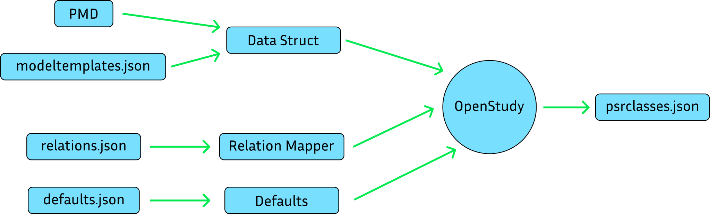

# OpenStudy Files and Structs 101

When creating or loading a study using the `OpenStudy` framework, PSRI uses different files.
This flowchart shows the order in which the files are used.

1. The classes and their attributes are defined in a `PMD` file.
2. Then, a `Model Template` file is used to map the classes to collections in the study.
3. Using the `Model Template` and the `PMD` file, the `Data Struct` file is created.
4. PSRI loads the `Data Struct`, `Relation Mapper` and `Defaults` files into structs and create a study, whose data will be stored in a file named `psrclasses.json`.

## How the structs are used

### Creating an element

When creating an element from a collection, `OpenStudy` uses the `Data Struct`, `Relation Mapper` and `Defaults` files to check if:
- The collection is defined in the `Data Struct` file.
- The element has all the attributes defined in the `Data Struct` file.
- In the case where the element does not have all the attributes, the `Defaults` file has the remaining ones.

### Creating a relation

When creating a relation between two collections, `OpenStudy` uses the `Relation Mapper` to check if:
- The relation is defined in the `Relation Mapper`
- The elements exist in the study

